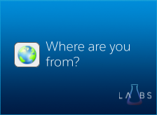
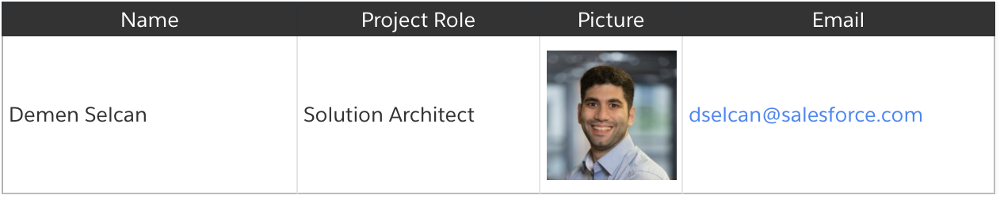

[](https://codecov.io/gh/CoreSEs/salesforce-where-are-you-from)


# What is Where are you from?



Where are you from is a Lightning Web Component (LWC) which detects a users default browser language and defaults applies it to public community pages if not already the case.

## Why is this needed?

Communities currently don't have browser language detection and guest/public users must manually change it via a picklist.

### Team



### General Documentation

[General Documentation](https://salesforce.quip.com/TLqYAFDEYx1W "General Documentation")

### Admin Guide

[Admin Guide](https://salesforce.quip.com/VtRDAIrL5dY0 "Admin Guide")

### FAQs

[FAQs](https://salesforce.quip.com/bPCLARuaUiWg#HdNAAActMCk "FAQs")

### AppExchange Listing

https://appexchange.salesforce.com/appxListingDetail?listingId=a0N4V00000HD5ckUAD

### Installing this package

This package can be install via following links

**_Production Orgs:_** https://login.salesforce.com/packaging/installPackage.apexp?p0=04t4x000000AImoAAG

**_Sandbox Orgs:_** https://test.salesforce.com/packaging/installPackage.apexp?p0=04t4x000000AImoAAG

### Installing it via SFDX

```shell
sfdx force:package:install --package "04t4x000000AImoAAG" --wait 10 --publishwait 10
```
